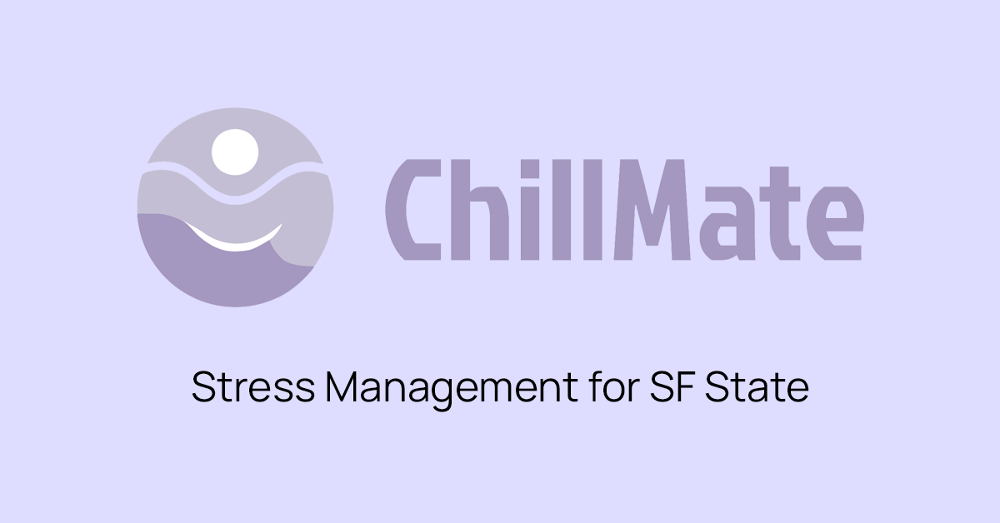

# ChillMate: Stress Management App for SFSU



## This is repository for: CSC648-S04-FA24-01

**Application URL: <https://chillmate-react.vercel.app/>**

Our stress management app is designed for San Francisco State University students and faculty, offering essential tools to combat stress:

- Chatbot Support: Get 24/7 personalized assistance and coping strategies.
- Journal: Track your thoughts and emotions to enhance well-being.
- Forum: Connect with peers for support and advice.
- Resources: Access a library of articles and techniques on mindfulness and relaxation.
- Task List: Stay organized and manage your responsibilities effectively.

Join us in fostering a healthier academic environment!

## Team 01 Members

| Student Name         | Student Email       | GitHub Username    | Student's role  |
| :------------------: | :-----------------: | :----------------: | :-------------: |
|   Eiffel Valentino   | evalentino@sfsu.edu |     eiffelv        | Team Leader     |
|   Gio Jung           | gjung1@sfsu.edu     |     GioJung97      | Scrum Master    |
|   Luis Carrillo      | lcarrillo2@sfsu.edu |     Myst1cLeaf     | GitHub Master   |
|   Chun Kai Liu       | cliu25@sfsu.edu     |     ChunKaiLiu     | Frontend Leader |
|   Sneha Katturu      | skatturu@sfsu.edu   |     snehakatturu   | Frontend Member |
|   William Widjaja    | wwidjaja@sfsu.edu   |     willi301       | Backend Leader  |
|   Jay Lodha          | jlodha@sfsu.edu     |     Jaylodha9      | Backend Member  |

## Running the App Locally

Prerequisites:

- [Node 21.x or higher](https://nodejs.org/en/download/package-manager)
- [Python 3.12.x](https://www.python.org/downloads/)

Steps with Command Line:

1. Clone the repository somewhere in your system

   ```bash
   git clone https://github.com/csc648/chillmate.git
   ```

2. Navigate to the Repository folder

   ```bash
   cd chillmate
   ```

Next follow the following steps:

### Frontend - React

1. In the "app" folder, install the dependencies

   ```bash
   cd app
   npm install
   ```

2. Ignoring all warnings, run the development server

   ```bash
   npm start
   ```

The server should start and listen to http://localhost:3000

### Backend - Flask
  
1. Using a different terminal window, navigate the "app/backend" folder

   ```console
   cd app/backend
   ```

2. Create a Virtual Environment to hold packages for the Flask app.

   ```console
   python -m venv venv
   ```

3. Activate the Virtual Environment

   ```console
   venv/Scripts/activate
   ```

4. Install dependencies

   ```console
   pip install -r requirements.txt
   ```

5. Try running the development server automatically with

   ```console
   python server.py
   ```

In most cases, the server should now listen to http://localhost:5000.

<details>
  
<summary>If That Doesn't Work</summary>

If there are port conflicts, try configuring the Flask App with Environment Variables:

1. Create a new file called .env and place it in the backend folder beside requirements.txt

  ```dotenv
  FLASK_APP=server
  FLASK_ENV=development
  FLASK_DEBUG=1
  FLASK_RUN_PORT=5050
  ```

2. Then run the development server with

  ```console
  flask run
  ```

</details>

### Connecting the Frontend to the Backend

With the base server set up, you need to set up Environment Variables to get the app working properly.

1. From the root of the repo, create new .env files in the "app" and "app/backend" folders (if it does not exist yet)
2. For "app/.env" file:

   ```dotenv
   # Temporary Solution
   DANGEROUSLY_DISABLE_HOST_CHECK=true

   # Set the Port according to Flask setup
   REACT_APP_FLASK_URI=http://127.0.0.1:5000
   ```

3. For "app/backend/.env" file (append if exists):

   ```dotenv
   # Database URI
   MONGO_URI = <Link to MongoDB Database>

   # Local development origin
   # Set the Port accordingly
   FRONTEND_ORIGIN=http://localhost:3000

   # API Keys
   GOOGLE_API_KEY = <Gemini API Key>
   fireworks_key = <Fireworks Key>
   ```

   > For Security Reasons, some of the values are not filled.
